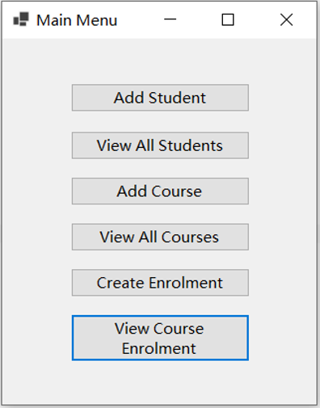
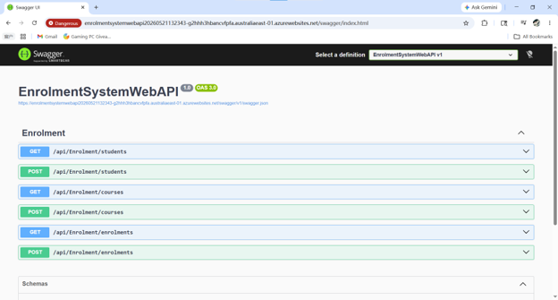
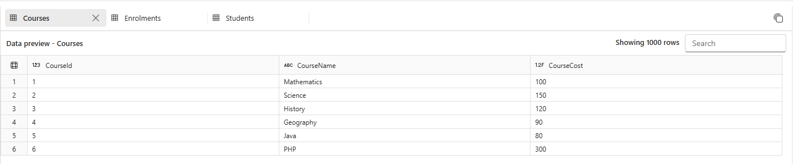
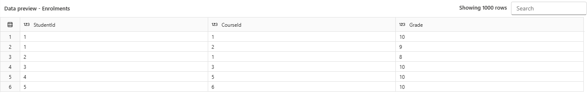
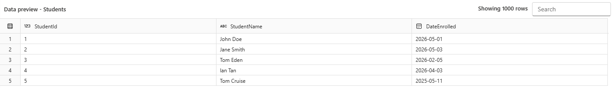

# Student Enrolment Management System

A cloud-based Student Enrolment Management System developed using **ASP.NET Core Web API**, **Entity Framework Core**, **Azure SQL Database**, and a **Windows Forms desktop client**.

The project demonstrates the development of a three-tier application, RESTful API design, cloud database integration, and desktop application development using the .NET ecosystem.

---

## Features

- Manage Students
  - View all students
  - Add new students

- Manage Courses
  - View all courses
  - Add new courses

- Manage Enrolments
  - View enrolment records
  - Create new enrolments

- Cloud Deployment
  - RESTful Web API hosted on Microsoft Azure
  - Azure SQL Database for persistent data storage

---

# System Architecture

```text
                 +----------------------+
                 |  Windows Forms Client|
                 +----------+-----------+
                            |
                      HTTP / JSON
                            |
                            v
                +------------------------+
                | ASP.NET Core Web API   |
                |  Controllers           |
                |  Services              |
                |  Entity Framework Core |
                +-----------+------------+
                            |
                     Entity Framework
                            |
                            v
                +------------------------+
                | Azure SQL Database     |
                +------------------------+
```

---

# Technology Stack

| Technology | Description |
|------------|-------------|
| C# | Programming Language |
| .NET 10.0 | Application Framework |
| ASP.NET Core Web API | REST API Development |
| Entity Framework Core | ORM |
| Azure SQL Database | Cloud Database |
| WinForms | Desktop Client |
| Swagger | API Documentation & Testing |
| Visual Studio 2026 | IDE |
| Git & GitHub | Version Control |

---

# Project Structure

```text
StudentEnrolmentSystem
│
├── EnrolmentSystemWebAPI
│   ├── Controllers
│   ├── DTOs
│   ├── Models
│   ├── Services
│   └── Program.cs
│
├── EnrolmentWinClient
│   ├── Forms
│   ├── Models
│   └── HttpClient
│
└── README.md
```

---

# REST API Endpoints

## Students

| Method | Endpoint | Description |
|--------|----------|-------------|
| GET | `/api/enrolment/students` | Retrieve all students |
| POST | `/api/enrolment/students` | Add a new student |

---

## Courses

| Method | Endpoint | Description |
|--------|----------|-------------|
| GET | `/api/enrolment/courses` | Retrieve all courses |
| POST | `/api/enrolment/courses` | Add a new course |

---

## Enrolments

| Method | Endpoint | Description |
|--------|----------|-------------|
| GET | `/api/enrolment/enrolments` | Retrieve all enrolments |
| POST | `/api/enrolment/enrolments` | Create a new enrolment |

---

# Database Design

The system contains three entities.

- Student
- Course
- Enrolment

Relationship

```text
Student
--------
StudentId (PK)
StudentName
DateEnrolled

        1
        |
        |
        |
        *
Enrolment
---------
StudentId (PK)(FK)
CourseId  (PK)(FK)
Grade

        *
        |
        |
        |
        1

Course
-------
CourseId (PK)
CourseName
CourseCost
```

The Enrolment table uses a **composite primary key** consisting of:

- StudentId
- CourseId

---

# Screenshots

## WinForms Client

### Main Menu



---

### Student Management


---

### Course Management


---

### Enrolment Management


---

## Swagger API



---

## Azure SQL Database





---

# Running the Project

## Clone Repository

```bash
git clone https://github.com/yourusername/student-enrolment-system-dotnet.git
```

---

## Configure Database

Update the connection string in:

```
appsettings.json
```

Example

```json
{
  "ConnectionStrings": {
    "DefaultConnection": "YOUR_AZURE_SQL_CONNECTION_STRING"
  }
}
```

---

## Run Web API

1. Update "launchBrowser" and environmnet in launchSettings.json
2. Run application

```
https://localhost:7070/swagger
```

---

## Run Windows Forms Client

1. Open the WinForms project.
2. Update the API BaseAddress if necessary.
3. Run the application.

---

# Learning Outcomes

This project demonstrates experience with:

- Object-Oriented Programming
- Layered Architecture
- RESTful API Development
- Entity Framework Core
- Dependency Injection
- Azure SQL Database
- Cloud Application Deployment
- Desktop Application Development
- HTTP Client Communication
- Git Version Control

---

# Future Improvements

- Update and Delete operations
- Authentication and Authorization
- Search and Filtering
- Pagination
- Logging
- Unit Testing
- Docker Containerization
- CI/CD with GitHub Actions

---

# Author

**Ian Tan**